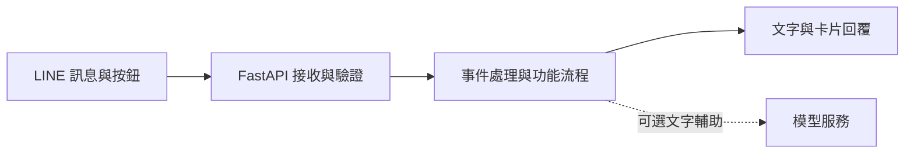

# AI Temple｜AI 宮廟

AI Temple 是一個以 LINE 為入口的文化互動服務提案，讓使用者在同一段對話中談心、求籤、祈願或查找宮廟。專案想改善宮廟資訊分散、不同功能需要反覆切換的問題，讓文化互動與資訊查詢能在熟悉的聊天介面中接續進行。

僅作為展示，公開版本收錄部分核心程式碼，無法直接執行或部署。

## 功能

- **廟埕談心**：用中文對話，協助整理心情與想法，並承接近期記憶脈絡。使用者可依需要切換到其他功能，也能清除本次對話脈絡。
- **求籤問事**：可默念或輸入問題，依參考流程抽籤與擲筊，以連續三次聖筊確認籤文。確認後可選擇 AI 參考解讀；個人化解讀需先取得傳送本次問題的同意。
- **心香祈願**：選擇祈願方向後，透過按鈕完成心香步驟與祝福。心願可以寫下一句話，也可以只在心裡想；設計上不建立永久祈願紀錄。
- **宮廟探索**：依位置、地區、主題或神祇查詢宮廟，以卡片呈現資訊、來源與地圖連結。搜尋和排序依資料品質與距離等規則處理，方便接著了解或規劃參拜。

[Demo 影片](https://youtu.be/0qnZk_Edo1Y?si=JdxLpXwnaHSiUUDR)

## 架構與技術

LINE 負責互動介面，後端接收事件後交由背景 worker 處理，再把結果組成訊息回傳。同一時間只有一個功能接收操作，切換時由共用導覽處理脈絡與清理。

| 技術／方法 | 用途 |
| --- | --- |
| LINE Messaging API | 接收訊息與按鈕操作，呈現文字、Quick Reply 與 Flex 卡片。 |
| Python／FastAPI | 提供 webhook，驗證 LINE 簽章並處理事件。 |
| 狀態機與事件佇列 | 記錄互動步驟、控制操作順序，由背景 worker 執行流程。 |
| Redis／PostgreSQL | Redis 管理短期狀態與脈絡；PostgreSQL 保存 webhook 去重紀錄。 |
| AI 模型 | 談心可選本機 Qwen 或 OpenAI API，AI 解籤使用 OpenAI API；這些路徑預設關閉。 |

談心預設採規則式回覆，抽籤、擲筊和宮廟排序也由程式處理。模型失敗時回退原有回覆，不改變籤筊結果。問題、心願與位置採短期保存設計；文化互動僅供體驗與參考，不代表神意、宮廟官方意見或專業建議。
