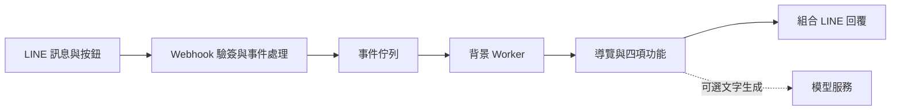

# 方案與架構

AI Temple 透過 LINE 訊息、按鈕與卡片提供四項互動。各功能有自己的流程，共用導覽與短期對話脈絡，讓使用者能在談心、求籤、祈願和查詢宮廟之間切換。

## 互動流程

| 功能 | 主要流程 |
| --- | --- |
| 廟埕談心 | 進場與隱私說明 → 對話 → 選擇繼續、切換功能或清除脈絡 |
| 求籤問事 | 選擇默念或輸入問題 → 允請 → 抽候選籤 → 連續三次聖筊確認 → 顯示籤文 → 可選 AI 解讀 |
| 心香祈願 | 選擇祈願方向與輸入方式 → 確認心意 → 心香步驟 → 祝福或清除 |
| 宮廟探索 | 選擇搜尋方式 → 查詢 → 查看宮廟資訊與地圖 → 接續詢問 |

## 系統流程

FastAPI 接收 webhook，驗證簽章後將事件放入佇列，再由同一應用程序內的背景 worker 處理。Redis 保存短期狀態與資料，PostgreSQL 保存 webhook 去重紀錄，減少重複處理。

## 主要設計

- **流程由程式管理。** 功能切換、籤筊結果、確認進度與宮廟排序都有明確規則，同一時間只有一個功能接收使用者操作。
- **模型按需要啟用。** 談心預設採規則式回覆，可選用本機模型或外部 API。AI 解籤在結果確認後才執行；個人化解讀需先取得傳送本次問題的同意。模型失敗時回退原有回覆，保留儀式結果。
- **資料只保留必要內容。** 對話與功能狀態設有保存期限及清除流程。心願本文和 GPS 不放入跨功能摘要；儲存、日誌與刪除行為仍需在實際環境驗證。
- **宮廟資訊附來源與品質標記。** 搜尋依資料記錄與固定規則處理，距離計算使用已驗證座標。資料更新與錯誤修正仍需持續維護。
- **互動有適用範圍。** 高風險問題與重大決策先做安全檢查，宗教用語也有約束。這些互動不能取代緊急協助或醫療、法律、財務等專業判斷。
